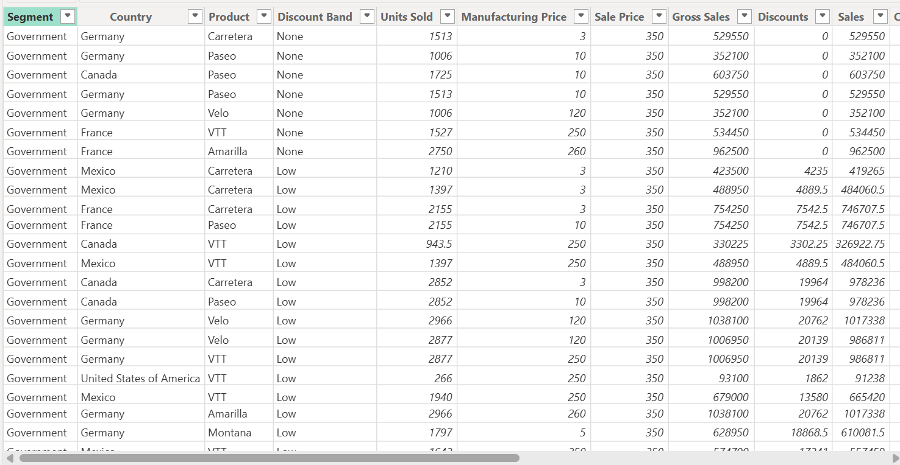
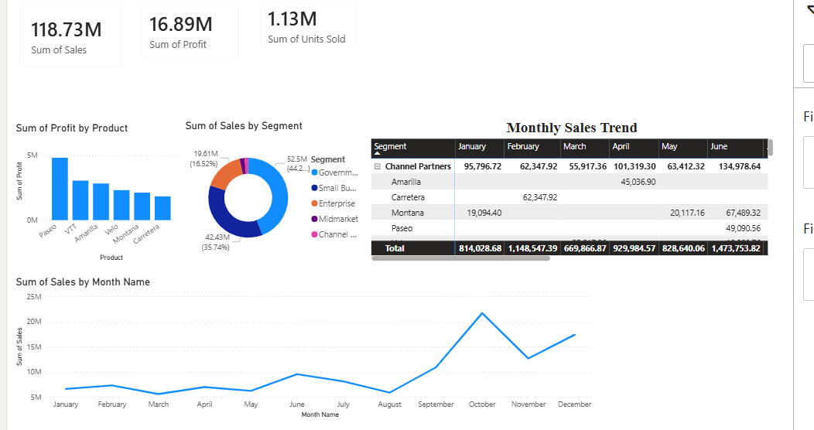

# Global-sales-data-Modeling-bi
A personal power Bi project focused on advanced data modeling, data transformation &amp; multi-dimensional analysis of global sales across segments, products and geographies.
# Global Sales Performance & Data Modeling Dashboard

## 📊 Project Overview
This repository contains a dedicated Power BI data model and dynamic dashboard designed to evaluate global sales and operational metrics. The project transforms raw organizational data into a structured format to track performance trends across multiple products, customer segments, and geographic regions.

## 🛠️ Data Modeling & Engineering Focus
The primary objective of this project was to design an optimized backend structure inside Power BI:
* **Data Transformation:** Leveraged Power Query to clean historical records, handle null values, standardize data types, and filter noise.
* **Relational Schema:** Implemented an optimized relational data model using distinct Fact and Dimension tables to enhance filtering efficiency and reporting speed.
* **Multi-Dimensional View:** Engineered seamless cross-filtering capabilities, allowing stakeholders to dynamically dissect financial results by country, product type, and business segment.

## 📈 Dashboard Preview

### 1. Executive Summary View
* **Key Metrics Analyzed:** $118.73M Total Sales | $16.89M Total Profit | 1.13M Units Sold

### 2. Product Performance View
* **Key Metrics Analyzed:** Country-specific sales distribution and geographical contribution.

---

## 📂 How to View and Interact with the Model
1. Download the `.pbix` file directly from this GitHub repository.
2. Open the file on your local machine using **Power BI Desktop**.
3. Interact with the slicers, timeline trends, and cross-filtering elements to explore the data model.
